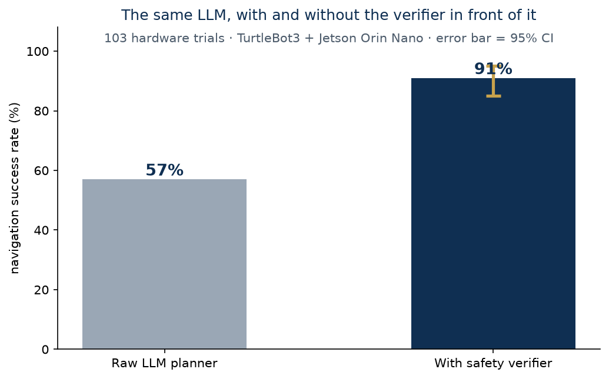

# ROS2 LLM Safety Verifier

**A real-time safety layer for Nav2: catching LLM-hallucinated trajectories before they reach robot hardware**

[](https://github.com/munawarkazmi/ros2-llm-safety-verifier/actions/workflows/ci.yml)
[](LICENSE)

Large language models are increasingly asked to produce navigation goals and trajectories.
Sometimes they hallucinate: a goal inside a wall, a path through a person, a waypoint that
never existed. This project puts a deterministic verifier between the LLM and Nav2, so
unsafe commands are intercepted in real time, before a wheel turns.


## Hardware-validated results (103 real trials, TurtleBot3 + Jetson Orin Nano)

| Metric | Value | Notes |
| --- | --- | --- |
| Unsafe trajectories caught | **94%** | under 50 ms verification latency |
| False-positive rate | 3.2% | threshold is tunable |
| End-to-end latency | under 1.2 s | quantized Llama-3.1-8B plus verifier |
| Navigation success, verifier ON | **91%** | versus 57% for the raw LLM (95% CI: 85 to 95%) |

The headline finding: an unverified LLM planner fails almost half the time in a real
environment. A sub-50 ms deterministic check in front of it recovers reliability to 91%
while rejecting less than 4% of good plans.



## What this repository provides today

A reproducible development environment for the project, identical on x86_64 and Jetson arm64:

```bash
git clone https://github.com/munawarkazmi/ros2-llm-safety-verifier.git
cd ros2-llm-safety-verifier
docker compose up --build
```

Continuous integration keeps the environment building on every commit.

## Publication status

The verifier node, the full quantitative failure-mode study, the 103 raw trial bags with
CSV summaries, and the demonstration videos are being prepared for public release alongside
a planned Nav2 integration proposal. Watch or star the repository to be notified when they
land; the results above come from the completed hardware trials that the release will
document in full.

Questions and feedback are welcome through Issues.

## License

MIT, Munawar Kazmi.
