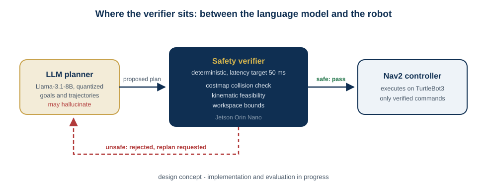

# ROS2 LLM Safety Verifier

**A real-time safety layer for Nav2: catching LLM-hallucinated trajectories before they reach robot hardware**

[](https://github.com/munawarkazmi/ros2-llm-safety-verifier/actions/workflows/ci.yml)
[](LICENSE)

Large language models are increasingly asked to produce navigation goals and
trajectories. Sometimes they hallucinate: a goal inside a wall, a path through
a person, a waypoint that never existed. The idea of this project is a
deterministic verifier between the LLM and Nav2 - costmap collision checks,
kinematic feasibility, workspace bounds - so unsafe commands are intercepted
before a wheel turns.

> **Status (July 2026): design stage - retraction of earlier claims.**
>
> Earlier versions of this README reported hardware-validated results (94% of
> unsafe trajectories caught, 103 TurtleBot3 trials, latency and success-rate
> figures). Those numbers were not backed by committed code, data, or
> completed experiments - this repository has never contained an
> implementation - and I have retracted them. I hold my repositories to the
> standard that every quantitative claim must be reproducible from what is
> committed; this one did not meet it.
>
> What exists today is the design below and a containerized development
> environment. Results will only ever reappear here together with the code,
> the raw data, and the harness that produce them.

## Design



The verifier sits between the LLM planner and the Nav2 controller. A proposed
goal or trajectory passes only if it clears three deterministic checks against
the live costmap and robot model:

1. **Collision** - no pose intersects a lethal or inflated obstacle,
2. **Kinematic feasibility** - curvature and velocity within the platform's limits,
3. **Workspace bounds** - every waypoint inside the mapped, known region.

Rejected plans trigger a replan request instead of reaching the controller.

## What this repository provides today

A containerized ROS 2 Humble + Nav2 development environment for the project,
built by CI on every commit:

```bash
git clone https://github.com/munawarkazmi/ros2-llm-safety-verifier.git
cd ros2-llm-safety-verifier
docker compose up --build
```

The compose file mounts the repository into the container workspace, so the
verifier package can be developed and colcon-built inside it as it lands.

## Roadmap

1. Verifier node (C++, subscribing to the LLM planner's proposals, publishing
   verified goals to Nav2) with unit tests against recorded costmaps.
2. A seeded evaluation harness with injected hallucination cases, so
   catch-rate and false-positive numbers are reproducible offline before any
   hardware claim is made.
3. Hardware trials (TurtleBot3 + Jetson Orin Nano), published together with
   the raw rosbags and analysis scripts.

## License

MIT, Munawar Kazmi.
